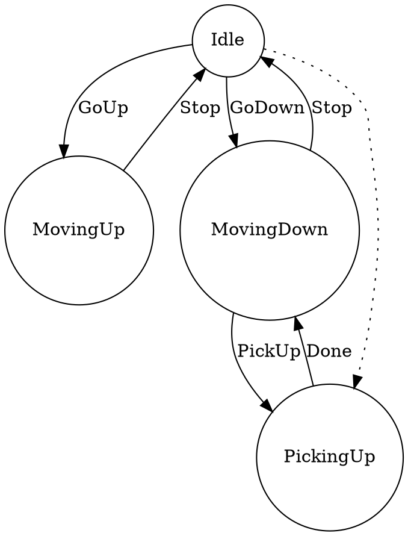
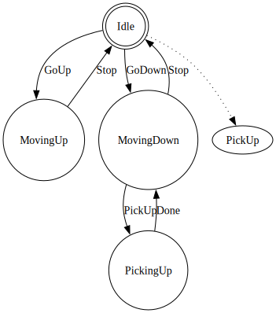

**Студент:** Бабушкин Александр Михайлович
**ИСУ:** 367845  
**Группа:** P3321  
**Университет:** НИУ ИТМО  
**Факультет:** Программной инженерии и компьютерной техники  
**Курс:** 3-й курс  

# Лабораторная работа: eDSL для конечных автоматов

## Требования к разработанному ПО  

### Описание  
eDSL (embedded Domain Specific Language) для конечных автоматов. eDSL должен позволять в явном виде описывать невозможные/игнорируемые переходы между состояниями. eDSL должен быть запускаемым и генерирующим описание в формате dot (подробнее см. проект graphviz). С использованием разработанного eDSL реализовать модель (одна из, определяется вариантом задания):

1. Лифта. При движении вниз - подбирать людей.
Светофора. 
2. Перекрёсток с главной дорогой и пешеходной кнопкой.

## Основные функциональные возможности

1. **Описание состояний и переходов**: Программа позволяет легко определять состояния с помощью макроса `state` и реализовывать переходы между ними с помощью макроса `transition`.
   
2. **Игнорируемые переходы**: С помощью макроса `ignore` можно явно указывать переходы, которые игнорируются. Это позволяет контролировать логику конечного автомата и обеспечивать большую предсказуемость в его поведении.

3. **Генерация графа**: Программа генерирует граф в формате DOT, который может быть визуализирован с помощью Graphviz, что позволяет легко анализировать структуру конечного автомата.

## Описание алгоритма

1. **Определение состояний**: Состояния конечного автомата задаются с использованием макроса `state`. Каждое состояние имеет уникальное имя.

2. **Определение переходов**: Переходы между состояниями задаются с помощью макроса `transition`, который принимает начальное состояние, событие и конечное состояние.

3. **Игнорируемые переходы**: Переходы, которые игнорируются, задаются с помощью макроса `ignore`. Это позволяет явно указывать, какие переходы не должны быть разрешены в определенных состояниях.

4. **Генерация графа**: При помощи функции `generate-dot` формируется текстовое представление графа в формате DOT, включающее состояния и переходы, а также игнорируемые переходы.

5. **Модель лифта**: В функции `lift-model` определяется модель конечного автомата liфта с состояниями, такими как *"Idle"*, *"MovingUp"*, *"MovingDown"*, *"PickingUp"*, и соответствующими переходами и игнорируемыми действиями.

## Реализация
```clojure
(ns fsm-edsl.core
  (:require [clojure.string :as str]))

(defrecord State [name])
(defrecord Transition [from label to])
(defrecord Ignore [from to])

(def states (atom []))
(def transitions (atom []))
(def ignores (atom []))

(defmacro state [name]
  `(do
     (swap! states conj (->State ~name))))

(defmacro transition [from label to]
  `(do
     (swap! transitions conj (->Transition ~from ~label ~to))))

(defmacro ignore [from to]
  `(do
     (swap! ignores conj (->Ignore ~from ~to))))

(defmacro fsm-model [& forms]
  `(do ~@forms))

(defn generate-dot []
  (let [state-nodes (map #(if (= (:name %) "Idle")
                            (str "  " (:name %) " [shape=doublecircle];") 
                            (str "  " (:name %) " [shape=circle];")) @states)
        transition-edges (map #(str "  " (:from %) " -> " (:to %) " [label=\"" (:label %) "\"];") @transitions)
        ignore-edges (map #(str "  " (:from %) " -> " (:to %) " [style=dotted];") @ignores)]
    (str "digraph FSM {\n"
         (str/join "\n" state-nodes) "\n"
         (str/join "\n" transition-edges) "\n"
         (str/join "\n" ignore-edges) "\n"
         "}")))


(defn lift-model []
  (fsm-model
   (state "Idle")
   (state "MovingUp")
   (state "MovingDown")
   (state "PickingUp")
   (transition "Idle" "GoUp" "MovingUp")
   (transition "Idle" "GoDown" "MovingDown")
   (transition "MovingUp" "Stop" "Idle")
   (transition "MovingDown" "Stop" "Idle")
   (transition "MovingDown" "PickUp" "PickingUp")
   (transition "PickingUp" "Done" "MovingDown")
   (ignore "Idle" "PickUp")))

(defn -main [] 
  (lift-model) 
  (let [dot-graph (generate-dot)]
    (spit "result.dot" dot-graph)
    (println dot-graph)))

```
### Код — [core.clj](./fsm-edsl/src/fsm_edsl/core.clj)
  
## Ввод/вывод программы

### Ввод
Программа не требует непосредственного ввода от пользователя. Все состояния и переходы определяются в коде.

### Вывод
После выполнения программы создаётся файл `result.dot`, который содержит граф конечного автомата в формате DOT. 

***Пример содержимого итогового графа (в формате DOT):***

***Пример содержимого итогового графа (в формате DOT):***
Пример содержимого итогового графа (в формате SVG):




## Выводы

1. **Использование eDSL**: Макросы для определения состояний и переходов делают язык легким для понимания и использования.

2. **Контроль логики**: Явное определение игнорируемых переходов помогает контролировать, какие действия допустимы в различных состояниях.

3. **Визуализация**: Генерация графа в формате DOT позволяет легко визуализировать структуру конечного автомата для анализа.

4. **Расширяемость**: eDSL можно адаптировать для создания более сложных автоматов и добавления новых функций.

